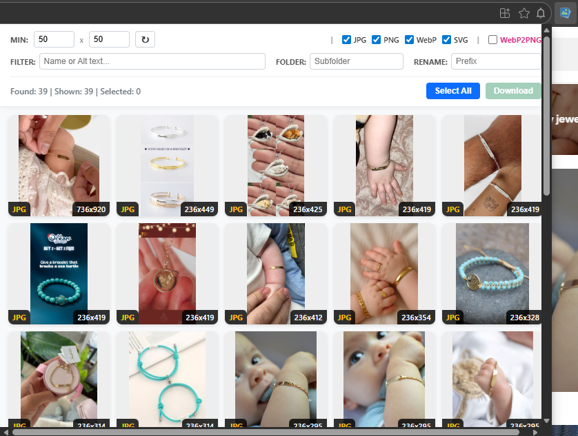

# 📸 Pro Image Collector (v7.1) - Autor Pricop Bogdan - bogdan.pricop@gmail.com


**Pro Image Collector** este o extensie Chrome avansată pentru extragerea, filtrarea și descărcarea imaginilor în masă. 
Gândită pentru designeri, dezvoltatori și cercetare OSINT, această extensie merge dincolo de simpla descărcare, oferind instrumente de analiză (Google Lens, TinEye), conversie automată și organizare a fișierelor.


*(Notă: Adaugă o captură de ecran în folderul repository-ului și actualizează calea de mai sus)*

---

## ✨ Funcționalități Cheie

### 📥 Extragere Puternică
* **Deep Scan:** Detectează imagini standard ``, imagini de fundal CSS (`background-image`) și rezolvă URL-urile relative.
* **Lazy Loading Support:** Scanează și imaginile care nu sunt încărcate complet.
* **Smart Linking:** Detectează dacă o imagine este un link către un produs/articol și oferă un buton dedicat pentru navigare.

### 🔍 Analiză & OSINT (Open Source Intelligence)
* **📷 Google Lens Integration:** Căutare vizuală inversă direct din popup pentru a găsi produse similare sau traduceri.
* **👁️ TinEye Integration:** Verifică sursa originală a imaginii sau drepturile de autor.
* **🔎 Smart Filters:** Filtrare avansată după dimensiuni (lățime/înălțime), tip fișier (JPG, PNG, WebP, SVG) și text (căutare în URL sau atributul `alt`).

### 🛠️ Utilitare Avansate
* **WebP to PNG Converter:** Conversie automată la descărcare pentru compatibilitate maximă.
* **Organizare:** Salvare în sub-foldere dedicate și redenumire automată a fișierelor (ex: `Vacanta_001.jpg`).
* **Lightbox & Edit:** Previzualizare mare a imaginilor cu funcție de **Rotire** înainte de descărcare.

### 🎨 Interfață Compactă
* Design optimizat pentru lățimea maximă permisă de Chrome (800px).
* Bară de acțiuni rapidă (Action Bar) pe fiecare thumbnail.
* Bară de status în timp real (Found | Shown | Selected).

---

## 🚀 Instalare (Developer Mode)

Deoarece această extensie este în faza de dezvoltare/sideload, se instalează astfel:

1.  **Descarcă codul:** Clonează acest repository sau descarcă arhiva ZIP și dezarhiveaz-o.
2.  **Deschide Chrome:** Mergi la adresa `chrome://extensions/`.
3.  **Activează Developer Mode:** Bifează comutatorul din colțul dreapta-sus ("Developer mode").
4.  **Încarcă extensia:**
    * Apasă butonul **"Load unpacked"** (Încarcă extensia neîmpachetată).
    * Selectează folderul unde ai fișierele (`manifest.json`, `popup.html`, etc.).
5.  Gata! Extensia ar trebui să apară în bara ta de instrumente.

---

## 📖 Ghid de Utilizare

### 1. Bara de Control (Sus)
* **Min Size:** Setează dimensiunile minime pentru a exclude iconițele mici (ex: 50x50).
* **Tipuri:** Bifează ce formate vrei să vezi (JPG, PNG, WebP, SVG).
* **WebP2PNG:** Bifează pentru a converti automat imaginile `.webp` în `.png` la descărcare.
* **Rescan (↻):** Apasă dacă ai dat scroll pe o pagină dinamică (ex: Instagram) pentru a găsi imagini noi.

### 2. Filtrare & Organizare (Mijloc)
* **Filter:** Scrie un cuvânt (ex: "pantof") pentru a afișa doar imaginile care conțin acel text în nume sau descriere.
* **Folder:** Scrie numele folderului (ex: `Proiecte/Design`) unde vrei să se salveze imaginile în Downloads.
* **Rename:** Prefix pentru fișiere (ex: `img` va genera `img_001.jpg`, `img_002.jpg`).

### 3. Acțiuni pe Imagine (Hover)
Când treci cu mouse-ul peste o imagine, apare bara de acțiuni:
* 👁️ **View:** Deschide imaginea în tab nou.
* 🔗 **Link:** Merge la pagina produsului (dacă există link).
* 📷 **Lens:** Caută cu Google Lens.
* 👁️ **TinEye:** Caută cu TinEye.
* 🖼️ **Preview:** Deschide modulul de previzualizare și rotire.

---

## 📂 Structura Proiectului

```text
/
├── manifest.json      # Configurația extensiei (Permissions: activeTab, downloads, scripting)
├── popup.html         # Interfața utilizator (UI) - HTML5 & CSS3
├── popup.js           # Logica principală (Filtrare, Download, Conversie Canvas)
├── content.js         # Scriptul injectat în pagină pentru extragerea DOM
└── icons/             # Iconițele extensiei (16, 48, 128px)
