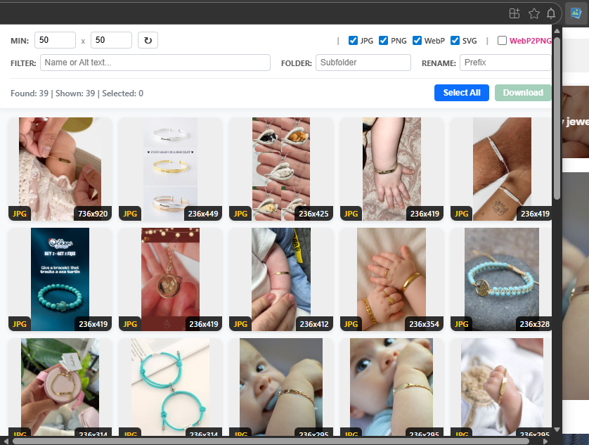

# 📸 Pro Image Collector (v8.0) - Autor Pricop Bogdan - bogdan.pricop@gmail.com


**Pro Image Collector** este o extensie Chrome avansată pentru extragerea, filtrarea, editarea și descărcarea imaginilor în masă.
Gândită pentru designeri, dezvoltatori și cercetare OSINT, această extensie merge dincolo de simpla descărcare, oferind instrumente de analiză (Google Lens, TinEye), editor de imagini complet, descărcare ZIP, conversie automată și organizare a fișierelor.


*(Notă: doar main form)*

---

## ✨ Funcționalități Cheie

### 📥 Extragere Puternică
* **Deep Scan:** Detectează imagini standard ``, imagini de fundal CSS (`background-image`), `srcset` și `<video poster>`.
* **Lazy Loading & Dynamic Content:** MutationObserver detectează automat imagini noi adăugate dinamic pe pagină.
* **Smart Linking:** Detectează dacă o imagine este un link către un produs/articol și oferă un buton dedicat pentru navigare.

### 🔍 Analiză & OSINT (Open Source Intelligence)
* **📷 Google Lens Integration:** Căutare vizuală inversă direct din popup pentru a găsi produse similare sau traduceri.
* **👁️ TinEye Integration:** Verifică sursa originală a imaginii sau drepturile de autor.
* **🔎 Smart Filters:** Filtrare avansată după dimensiuni (lățime/înălțime), tip fișier (JPG, PNG, WebP, SVG, GIF) și text (căutare în URL sau atributul `alt`).

### 🎨 Editor de Imagini Integrat
* **Crop:** Decupare procentuală a marginilor.
* **Resize:** Scalare la orice procent.
* **Flip & Rotate:** Oglindire orizontală și rotire 90° (se aplică real pe canvas, nu doar vizual).
* **Noise:** Adaugă grain/zgomot aleatoriu.
* **Color Shift:** Modifică nuanța și saturația.
* **Obfuscate:** Blur subtil + sharpen pentru alterarea pixelilor.
* **Re-JPEG:** Recompresie JPEG la calitate configurabilă.
* **⚡ Magic Cascade:** Un singur click aplică toate transformările în secvență.
* **Undo/Redo:** Stack de până la 20 stări (Ctrl+Z).
* **Export Format:** Alege între PNG, JPG sau WebP la descărcare.

### 📦 Descărcare Flexibilă
* **Download Individual:** Descarcă fiecare imagine separat (modul clasic).
* **Download ZIP:** Bifează "ZIP" pentru a descărca toate imaginile selectate într-un singur fișier `.zip`.
* **WebP to PNG Converter:** Conversie automată la descărcare pentru compatibilitate maximă.
* **Organizare:** Salvare în sub-foldere dedicate și redenumire automată a fișierelor (ex: `Vacanta_001.jpg`).
* **Progress Bar:** Bară de progres reală cu contor la descărcare.

### ⌨️ Productivitate
* **Drag Select:** Trage mouse-ul peste grid pentru selecție rapidă (Ctrl+drag = toggle).
* **Keyboard Shortcuts:** `Ctrl+A` select all, `Ctrl+D` download, `Ctrl+Z` undo, `Esc` close editor.
* **Copy URL:** Copiază URL-ul imaginii în clipboard dintr-un singur click.
* **Grid Slider:** Ajustează numărul de coloane (3-8) din grid.
* **Setări Persistente:** Filtrele și preferințele se salvează automat între sesiuni.

### 🎨 Interfață Compactă
* Design optimizat pentru lățimea maximă permisă de Chrome (800px).
* Bară de acțiuni rapidă (Action Bar) pe fiecare thumbnail cu tooltips.
* Bară de status în timp real (Found | Shown | Selected).
* Empty state cu mesaj informativ când nu sunt imagini.

---

## 🚀 Instalare

### Din Chrome Web Store
1. Mergi la pagina extensiei pe Chrome Web Store.
2. Apasă **"Add to Chrome"**.
3. Gata!

### Developer Mode (Sideload)
1.  **Descarcă codul:** Clonează acest repository sau descarcă arhiva ZIP și dezarhiveaz-o.
2.  **Deschide Chrome:** Mergi la adresa `chrome://extensions/`.
3.  **Activează Developer Mode:** Bifează comutatorul din colțul dreapta-sus ("Developer mode").
4.  **Încarcă extensia:**
    * Apasă butonul **"Load unpacked"** (Încarcă extensia neîmpachetată).
    * Selectează folderul unde ai fișierele (`manifest.json`, `popup.html`, etc.).
5.  Gata! Extensia ar trebui să apară în bara ta de instrumente.

---

## 📖 Ghid de Utilizare

### 1. Bara de Control (Sus)
* **Min Size:** Setează dimensiunile minime pentru a exclude iconițele mici (ex: 50x50).
* **Tipuri:** Bifează ce formate vrei să vezi (JPG, PNG, WebP, SVG, GIF).
* **WebP2PNG:** Bifează pentru a converti automat imaginile `.webp` în `.png` la descărcare.
* **Rescan (↻):** Apasă dacă ai dat scroll pe o pagină dinamică (ex: Instagram) pentru a găsi imagini noi.

### 2. Filtrare & Organizare (Mijloc)
* **Filter:** Scrie un cuvânt (ex: "pantof") pentru a afișa doar imaginile care conțin acel text în nume sau descriere.
* **Folder:** Scrie numele folderului (ex: `Proiecte/Design`) unde vrei să se salveze imaginile în Downloads.
* **Rename:** Prefix pentru fișiere (ex: `img` va genera `img_001.jpg`, `img_002.jpg`).

### 3. Opțiuni de Descărcare
* **Grid Slider:** Glisează pentru a ajusta numărul de coloane (3-8).
* **ZIP:** Bifează pentru a descărca toate imaginile selectate ca un singur fișier ZIP.
* **Export Format:** Alege formatul de export pentru imaginile editate (PNG/JPG/WebP).

### 4. Acțiuni pe Imagine (Hover)
Când treci cu mouse-ul peste o imagine, apare bara de acțiuni:
* 👁️ **View:** Deschide imaginea în tab nou.
* 🔗 **Link:** Merge la pagina produsului (dacă există link).
* 📷 **Lens:** Caută cu Google Lens.
* 👁️ **TinEye:** Caută cu TinEye.
* 📋 **Copy URL:** Copiază URL-ul imaginii.
* 🖼️ **Editor:** Deschide editorul de imagini.

### 5. Scurtături de Tastatură
| Scurtătură | Acțiune |
|---|---|
| `Ctrl+A` | Selectează / Deselectează toate imaginile vizibile |
| `Ctrl+D` | Descarcă imaginile selectate |
| `Ctrl+Z` | Undo în editor |
| `Esc` | Închide editorul |

---

## 📂 Structura Proiectului

```text
/
├── manifest.json          # Configurația extensiei (Manifest V3)
├── popup.html             # Interfața utilizator (UI)
├── popup.css              # Stiluri CSS (extras separat)
├── popup.js               # Logica principală (Filtrare, Download, Editor, ZIP)
├── content.js             # Script injectat pentru extragerea DOM + MutationObserver
├── jszip.min.js           # Biblioteca JSZip pentru descărcare ZIP
├── PRIVACY.md             # Politica de confidențialitate
├── store-description.txt  # Descriere pentru Chrome Web Store
├── icon16.png             # Iconiță 16x16
├── icon48.png             # Iconiță 48x48
└── icon128.png            # Iconiță 128x128
```

---

## 🔒 Permisiuni

| Permisiune | De ce e necesară |
|---|---|
| `activeTab` | Scanează tab-ul curent pentru imagini |
| `scripting` | Injectează content script-ul de extragere |
| `downloads` | Salvează imaginile pe calculator |
| `storage` | Persistă preferințele utilizatorului local |

Extensia **NU** colectează, transmite sau stochează date personale. Toate operațiunile au loc local în browser. Vezi [PRIVACY.md](PRIVACY.md) pentru detalii.

---

## 📋 Changelog

### v8.0 (2026-04-01)
* **Rewrite major** cu fix-uri de securitate și funcționalități noi
* Fix deduplicate imagini (Set → Map)
* Fix vulnerabilitate XSS (construire DOM programatică)
* Fix rotire reală pe canvas (nu doar CSS)
* Fix selectAll respectă toate filtrele
* Adăugat descărcare ZIP (JSZip)
* Adăugat drag-to-select pe grid
* Adăugat MutationObserver pentru pagini dinamice
* Adăugat setări persistente (chrome.storage)
* Adăugat keyboard shortcuts (Ctrl+A/D/Z, Esc)
* Adăugat undo/redo în editor (20 stări)
* Adăugat copy URL, export format, grid slider
* Adăugat progress bar la descărcare
* Adăugat empty state, tooltips
* Extras CSS în fișier separat
* Eliminat `host_permissions` (securitate îmbunătățită)
* Suport srcset, video poster, GIF

### v7.1
* Editor de imagini cu Crop, Resize, Flip, Noise, Color, Obfuscate, Re-JPEG
* Magic Cascade
* Google Lens & TinEye integration
* WebP to PNG conversion

---

## 📄 Licență

MIT License - vezi fișierul LICENSE pentru detalii.
